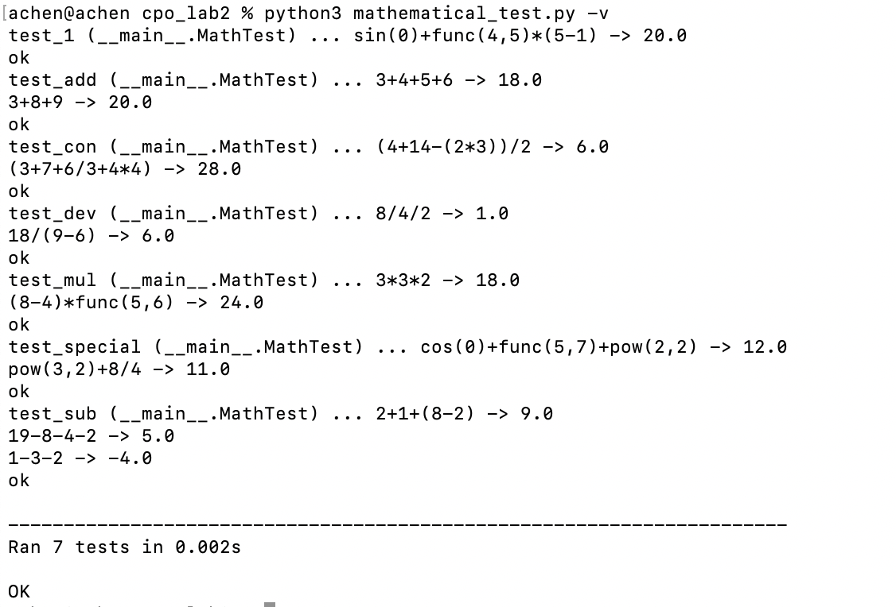
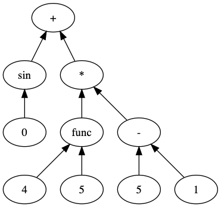
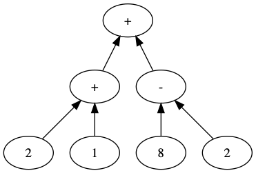
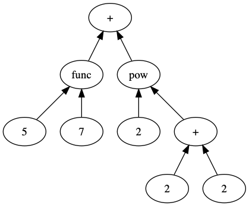

# cpo_lab2

1.Title: Computational Process Organization Lba2

2.List of group members: Chen Sihan 192050195 Yue Xueying 192050217

3.Laboratory work number: 1

Variant description: Mathematical expression:
Input language – str like a + 2 - sin(-0.3)*(b - c).
Should support user-specific functions.
Visualization as dataflow by GraphViz DOT.

4.Synopsis:
the str that we input to calculate is looks like  this "3+4-sin(x)",but it is difficult to calculate for computer
because it is hard to understand for computer, so in order to make it easy, we first transform the expression into 
Reverse Polish in other words it is Post-order expression.if a string is "a+b*c-d",it will translated into 
"abc*+d-".And then we transform the Post-order expression into a tree.the node is Operator and the right and 
left is number.we calculate the tree.

5.Contribution summary for each group member (should be checkable by git log and git blame): ChenSihan design the main mathematical code,and XueyingYue
test it ,debug it,do some corrections.

6.Explanation of taken design decisions and analysis: 
First we should transform string into Reverse Polish notation.we need two stack one to save nodes and one to save 
operation and a dictionary to make the priority of operation .when we meet number,we push it into the nodes_stack,if it is not numbers, we consider other situation
if it is '(', then we push it into op_stack, if it is ')',then the op_stack should pop its element and push 
those element into nodes_stack until it meet '('. If op_stack is not empty and the priority of the top of the stack
is bigger than current element's priority ,then pop the top operate and push it into node_stacks.we have scan the string
then we should see whether the op_stack is empty,if not, we should pop the elements and push it into nodes_stack.
Second,we have transform string into Reverse Polish notation,the next step we should do is transform it into a tree.
if it is not operator, it will be a leaf node,if it is operator then it will be a parent node,and pop two element
will be its right and left node.

7.Work demonstration (how to use developed software, how to test it), should be repeatable by an instructor by given command-line examples;

Abstract Syntax Tree:
1. sin(0)+func(4,5)*(5-1)

2. 2+1+(8-2)

3. func(5,7)+pow(2,2+2)

8.Conclusion
In this lab,we completed transform a string into Reverse Polish node and then transform it into tree
we have accomplish the function +，-,*，/，sin,cos,tan,pow and so on.and we calculate the result correctly.
And the we visualize the process of calculate.
      